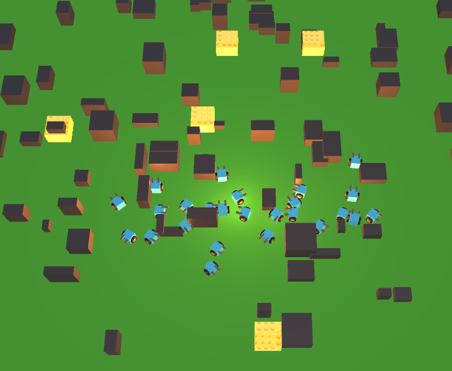

# Game of Life
___________________________

Format: 

Change brings opportunities. Change, sometimes, is the only way to survive, let alone thrive. In this small simulated game of life described below, you will see how an increase in one's willingness to adapt to changes leads to new resources, opportunities, and chances to prosper in life, although mindlessly embracing all changes without thoughtful planning may cause unwanted damages.   

Background story:
This is a small world of tiny robots, named The Kingdom of Gearminds. The robots live on cheese, specifically Swiss Cheese (for no better reason than "why not"), and for the love of that delicious awesomeness, they work all day long searching for cheese without rest. The tiny creatures are simple beings with limited vision. When finding cheese, they pick it up and head home, leaving a trail of cheese crumbs for their fellows to follow.

How does it work:
As the master of the game, you can influence the robots to be more receptive to changes by using the slider at the bottom. The further you move the slider right, the more adventurous the robots become. They tend to explore the greener grounds. Be aware that the robots have their own minds and may not follow your wishes. They may break out in sumo wrestling on right of way or simply stare at the rocks ponding whether they are in a real world or simulation.
If you keep the slider towards the left, you would see how the robots keep following the old trails even when the cheese is all gone. On the other hand, if you keep it too much to the right, the robots break into anarchy and don’t like to follow trails.

Play it here: 
---------------------
Low resolution in browser link : https://sarkarsaurabh.github.io/

For better viewing experience download and run the files here:

•	Windows: https://github.com/sarkarsaurabh/game_of_life/raw/master/Windows%20Build/Game_of_life.zip

•	OSX: https://github.com/sarkarsaurabh/game_of_life/raw/master/OSX%20Build/Game%20of%20Life.zip
